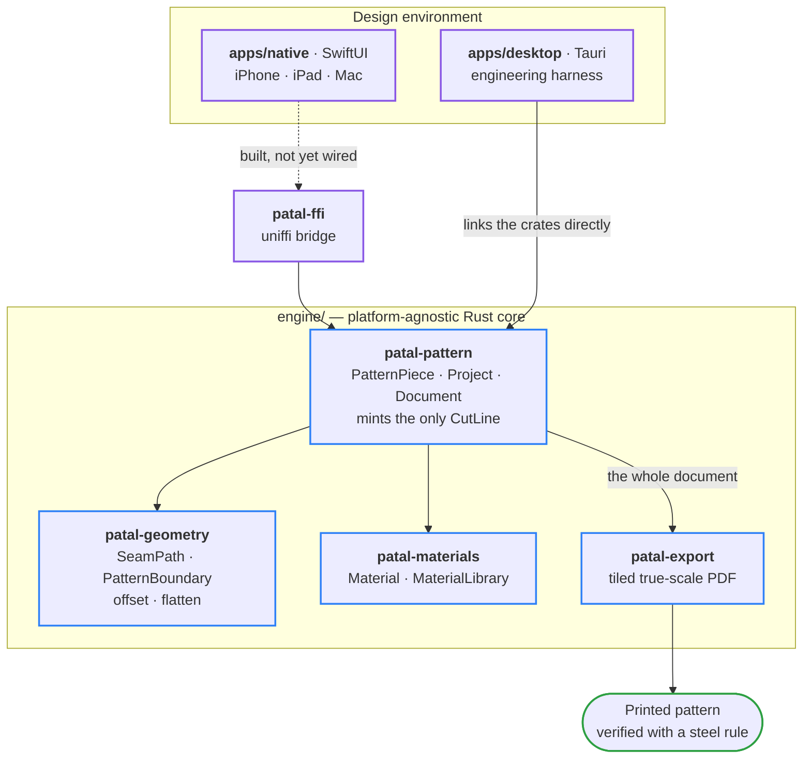

<div align="center">

# Pātāl

**Garment CAD.** A precision pattern-making system for garment engineering —
from the first drafted line to production-ready, cuttable output.

[](https://github.com/satex25/Patal/actions/workflows/ci.yml)
[](rust-toolchain.toml)
[](apps/native/Package.swift)
[](#verification)
[](LICENSE)

[Documentation](docs/) · [Current status](docs/status.md) · [Decision records](docs/adr/) · [Roadmap](docs/roadmap.md) · [satex25.co](https://satex25.co)

</div>

---

## What this is

**GCAD — Garment CAD.** The discipline is closer to mechanical CAD than to
illustration: a pattern is a dimensioned, tolerance-bearing engineering
drawing that gets manufactured in a physical material. A seam allowance is an
offset with a mitre limit. A sleeve cap is a cubic Bézier. A graded size run
is a parametric transform. Getting any of them wrong is not a rendering
artifact — it is cloth cut to the wrong shape.

Pātāl is one platform-agnostic Rust engine driving native front ends across
iPhone, iPad, Mac, and Windows. The engine holds the geometry, the material
model, and the document format. The front ends hold nothing that decides a
dimension.

> **Pātāl** (पाताल) — in Hindu cosmology, the netherworld: one of seven realms
> beneath the earth, vast and richly structured, built downward from a surface
> few ever see. Naming conventions are fixed in
> [ADR-002](docs/adr/ADR-002-naming-convention.md): `Pātāl` in prose, `Patal`
> for toolchains and identifiers.

---

## The rule everything else answers to

From the header of `engine/crates/geometry/src/lib.rs`, and it outranks every
other convention in this repository:

> **Every operation here is either correct or loud.** A pattern piece that is
> silently wrong is worse than one that refuses to compute: the first gets cut
> out of cloth, the second gets fixed.

There is no fallback path that returns a plausible number. Non-finite
coordinates, a zero-length edge, an inset deeper than the piece can give, a
seam allowance that exceeds a curve's radius — each returns a typed error
naming the failure and, where it is knowable, *where* it happened. A failed
offset reports which two edges cross, so an interface can point at the defect
instead of merely announcing one.

---

## Guarantees enforced by the type system

These are the load-bearing invariants. Each is a compile-time or
construction-time property, not a convention a reviewer has to remember — the
distinction matters, because conventions decay and types do not.

| Guarantee | How it is enforced | Why it exists |
|---|---|---|
| **One implementation of the cut path** | `CutLine` has a private field and no public constructor. It is minted only by `PatternPiece::cut_boundary`. | Two pieces of code deciding where cloth gets cut is a defect that surfaces in fabric. A second opinion is unrepresentable, not merely discouraged. |
| **A piece stores the curve it was drawn with** | `PatternPiece.outline` is a `SeamPath`. The polygon is derived on demand and never persisted. | A file that stores the flattened polygon cannot be edited back into its curves. Storing both would let a document assert an outline that disagrees with its own geometry. |
| **The document owns its tolerance** | `flatten_tolerance_mm` is a validated private field on `Project`; `export_tiled_pdf` takes a `&Project`, not loose pieces plus a number. | A caller passing a tolerance that disagrees with the file's produces output that disagrees with the file — silently, in the direction that matters. |
| **True scale, or nothing** | `Mm` and `Pt` are distinct types with exactly one conversion. No scale parameter, no fit-to-page. | A millimetre in the model is a millimetre on the paper, or the pattern is wrong. |
| **Invariants hold for a value's whole life** | Construction is the only way in. `PatternBoundary`, `SeamPath`, `GrainLine`, `PieceId` and `Material` all validate on the way in — including from disk, via `serde(try_from)`. | A hand-edited or corrupted file must not be able to smuggle in a state the constructor would have refused. |
| **Curves layer above the kernel, never inside it** | `SeamPath`/`EdgeSegment` sit on top of the polygon kernel; the kernel is untouched. ([ADR-003](docs/adr/ADR-003-curve-representation.md)) | The kernel is the most-tested code in the project. Curves earn their place above it rather than destabilising it. |
| **Identity is not a name** | `PieceId` and `MaterialId` are UUID newtypes, `serde(transparent)`, with no `Default`. | Two pieces can legitimately both be called "Front". Grading and export index by identity. |

---

## Capabilities

Status is deliberately confined to this one table so the rest of this document
stays true as the work lands. **●** shipped · **◐** partial · **○** planned.

| | Capability | Notes |
|:-:|---|---|
| ● | **Curve-native pattern geometry** | `SeamPath` of `Edge`s, each carrying its own join. Cubic Béziers, adaptive flattening, closed-form-verified curvature. |
| ● | **Seam allowance & cut line** | Outward/inward offset, mitre limit, self-intersection detection with the crossing edge indices reported. |
| ● | **Offset-aware flattening** | `flatten_for_offset` tightens discretisation so the tolerance still holds *after* the offset, not just before it. |
| ● | **Document format** | Schema-versioned, material references validated on load, every type round-trips. |
| ● | **Piece identity & grain line** | `PieceId`, and a directional `GrainLine` — the prerequisite for any lay plan on napped or directional cloth. |
| ● | **Tiled true-scale PDF export** | Dependency-free writer, registration crosses, 50 mm calibration square on every sheet. **Not yet printed** — see [Verification](#verification). |
| ◐ | **Schema v2 & migration** | Documents are at schema v1. The v2 shape is specified and awaiting sign-off; a version-tolerant loader and a lossless v1→v2 migration are the next increment. |
| ◐ | **Rust ↔ Swift bridge** | `patal-ffi` exposes fallible operations across uniffi as `Result`. Tested from the Rust side; no bindings generated, no XCFramework, no caller yet. |
| ○ | **Grading (size runs)** | Pure Rust, testable headlessly. A pattern tool that cannot grade is a drawing tool. |
| ○ | **DXF-AAMA/ASTM export** | The factory-facing format. Needs a reference capture before it can start ([ADR-008](docs/adr/ADR-008-export-format-decisions.md) leaves the ruling open on purpose). |
| ○ | **Parametric constraint solver** | Patterns as a living system where an edit propagates. A project in its own right, not a feature. |
| ○ | **Multi-piece nesting / lay plan** | 2D bin packing constrained by grain. Both dependencies are now met. |
| ○ | **Pattern primitives** | Darts, notches, pleats, facings. The `Edge` container exists so each arrives as a field rather than a schema migration. |
| ○ | **Metal canvas** | Per [ADR-001](docs/adr/ADR-001-stack-selection.md). Not `wgpu` — a portable abstraction caps the ceiling for the primary target. |
| ○ | **Sync · Intelligence** | Deliberately last. An AI collaborator needs something worth acting on first. |

The authoritative, dated view is [`docs/status.md`](docs/status.md). If it and
this table ever disagree, that file wins.

---

## Architecture

One engine. Two front ends. Nothing above the engine decides a dimension.



`apps/desktop` links the engine crates directly — both are Rust. `apps/native`
will reach them through uniffi-generated bindings packaged as an XCFramework,
once a macOS toolchain is available to build one. The dashed edge is the seam
that is built and tested but not yet wired.

```
patal/
├── engine/                    Rust workspace — the platform-agnostic core
│   └── crates/
│       ├── geometry/          patal-geometry   the polygon kernel + authored curves
│       ├── materials/         patal-materials  material model with stable identity
│       ├── pattern/           patal-pattern    pieces, projects, documents, cut lines
│       ├── export/            patal-export     tiled true-scale PDF, zero dependencies
│       └── ffi/               patal-ffi        uniffi bindings exposed to Swift
├── apps/
│   ├── native/                SwiftUI — iPhone, iPad, Mac (one shared codebase)
│   └── desktop/               Tauri — engineering harness, NOT a shipping target
├── docs/                      all project documentation — start at docs/README.md
├── scripts/                   cargo.bat — the Windows build wrapper, see below
└── reference/                 vendored upstream clones, git-ignored
```

### Design environment

**`apps/native`** — `PatalKit`, a Swift package holding model mirrors of the
engine's domain types and a SwiftUI shell. It deliberately holds **no
geometry**. A hand-ported offset kernel once lived here; it was deleted rather
than pinned with a conformance corpus, because two implementations of the cut
path is a liability whichever one drifts.

**`apps/desktop`** — an engineering harness, and explicitly not a product.
[ADR-001](docs/adr/ADR-001-stack-selection.md) rejected Tauri as a shipping
target; [ADR-005](docs/adr/ADR-005-tauri-as-engineering-harness.md) explains
why it is unfrozen for development anyway. It is the only thing in this
repository that runs on the Windows machine Pātāl is developed on: it draws a
bodice front with live tolerance and seam-allowance sliders, reports per-frame
cost against a 120 Hz budget, surfaces the engine's refusals verbatim, and
writes and re-reads a real `.patal` file. Disposable by design.

---

## Verification

```
168 tests   ·   fmt   ·   clippy -D warnings   ·   rustdoc -D warnings   ·   cargo deny   ·   5 CI jobs
```

Every pull request, and every push to `main`, runs the full matrix: the engine
on Linux **and** Windows, the Tauri harness, the Swift package on macOS, and a
non-blocking RustSec advisory scan that also runs weekly on a schedule. Broken
intra-doc links are build failures. Dependency licences, bans and sources are
enforced, not audited after the fact.

Note that pushing a feature branch runs *nothing* — CI is bound to
`pull_request` and to `main`. On this project "pushed" is not "green", which
matters because the macOS jobs are the only place the Swift package is ever
compiled.

The suite is layered on purpose:

- **Unit tests** for behaviour at the type boundary.
- **A property suite** over generated input — which is how it was discovered
  that `serde_json` does not round-trip every `f64` without the
  `float_roundtrip` feature, a genuine defect for a CAD file format.
- **A closed-form curve oracle**, so the flattener is checked against an
  analytic answer rather than against its own output.
- **A byte-compared golden PDF**, viable only because the writer is
  hand-rolled and stamps no clock — a general-purpose PDF crate would embed a
  timestamp and make the comparison meaningless.
- **A benchmark that has cancelled work.** The drag loop measured at roughly
  1% of a 120 Hz frame at manufacturing tolerance, so a planned
  coarse-preview-during-drag optimisation was dropped rather than built.

### What a green build does not prove

This is the part most projects leave out, and it is the part that matters
most here.

**The PDF has never been printed.** Every scale claim above is the software
agreeing with itself. Rendered through pdfium the 50 mm calibration square
measures 50.004 mm and the 200 mm rule 200.008 mm at 600 DPI — but no steel
rule has been on paper, on two printers, with the driver recorded.
[`docs/setup/printing.md`](docs/setup/printing.md) is the runbook for the
measurement it still has to survive, and it is the only test in this project
that can return the answer *"the software is wrong."*

**No pattern maker has assessed the output.** A pattern that passes 168 tests
and cannot be sewn is a pattern that fails. That verdict is outstanding.

Claims in this repository are written to be falsifiable for exactly this
reason. A number without a method behind it is decoration.

---

## Getting started

### Prerequisites

| | Requirement |
|---|---|
| **Rust** | Pinned by [`rust-toolchain.toml`](rust-toolchain.toml) (1.97.1). rustup picks it up automatically on first `cargo` invocation in this checkout. |
| **Windows** | Visual Studio Build Tools with the **Desktop development with C++** workload — Rust's MSVC target links with `link.exe`, which ships with that workload and nothing else. |
| **Node** | Pinned to 24.18.1 by [`apps/desktop/.nvmrc`](apps/desktop/.nvmrc); `nvm use` in that directory picks it up. Needed only for the desktop harness. |
| **macOS + full Xcode** | For `apps/native`. Command Line Tools alone can `swift build` but cannot `swift test` — `XCTest` ships with Xcode proper. |

### Build and test

```sh
# Engine — the core, and the only part with no platform requirements
cd engine && cargo test --workspace

# Swift package (until Xcode wires it into an app — see apps/native/README.md)
cd apps/native && swift build

# Engineering harness
cd apps/desktop && npm install && npm run tauri dev
```

<details>
<summary><b>Windows + Git Bash: read this before your first build fails</b></summary>

<br>

`cargo build` fails with an error that looks nothing like the real problem:

```
= note: /usr/bin/link: extra operand '/NOLOGO'
error: linking with `link.exe` failed: exit code: 1
```

Git Bash ships a coreutils `link` that shadows MSVC's `link.exe` on `PATH`, so
cargo invokes the wrong program. **rustc's own hint is misleading here** — it
suggests repairing your Visual Studio installation, which is fine and is not
the cause.

Use the committed wrapper. It locates the toolset with `vswhere`, sources
`vcvars64.bat`, and runs cargo with a correct `PATH`:

```sh
cmd //c 'scripts\cargo.bat test --workspace --locked'
cmd //c 'scripts\cargo.bat clippy --workspace --all-targets --locked -- -D warnings'
cmd //c 'scripts\cargo.bat fmt --check'
```

From PowerShell or `cmd`, drop the `cmd //c` and call `scripts\cargo.bat`
directly. It defaults to the `engine/` workspace; point it elsewhere with
`PATAL_CARGO_DIR`:

```sh
PATAL_CARGO_DIR='C:\path\to\patal\apps\desktop\src-tauri' cmd //c 'scripts\cargo.bat clippy'
```

This deliberately stays out of `.cargo/config.toml`: the vcvars path is
machine-local and would break CI, which already has a working linker. A
"Developer Command Prompt for VS" works without the wrapper — the wrapper
exists so the ordinary shell you already have open does the right thing.

</details>

Contribution conventions, including the commit and review standard, are in
[`CONTRIBUTING.md`](CONTRIBUTING.md).

---

## Documentation

Documentation lives in the repository, versioned alongside the code it
describes — a rule you cannot read is not a rule.

| Path | What lives there |
|---|---|
| [`docs/status.md`](docs/status.md) | Where the work actually is. Single source of truth; if anything disagrees with it, it wins. |
| [`docs/roadmap.md`](docs/roadmap.md) | The pillars not built yet, and why that is fine. |
| [`docs/memorandum.md`](docs/memorandum.md) | The founding vision document. |
| [`docs/adr/`](docs/adr/) | Architecture Decision Records — constraints the code must obey, including what each decision *rejected* and what it must not be read as meaning. |
| [`docs/analysis/`](docs/analysis/) | Domain and codebase audits, including the pattern primitive census and the incumbent persistence probe that supplies its evidence. |
| [`docs/setup/`](docs/setup/) | Toolchain notes and the true-scale printing runbook. |
| [`docs/plans/`](docs/plans/) | Dated execution blueprints, kept with their corrections visible rather than tidied after the fact. |

---

## License

**Proprietary.** Copyright © 2026 satex25. All rights reserved. See
[`LICENSE`](LICENSE).

The source is published for reference and review. **Publication grants no
licence** to use, copy, modify, or distribute it. Public and proprietary is
the intended state, not an oversight.

<div align="center">
<sub>Built for the moment a pattern leaves the screen and meets the cloth.</sub>
</div>
